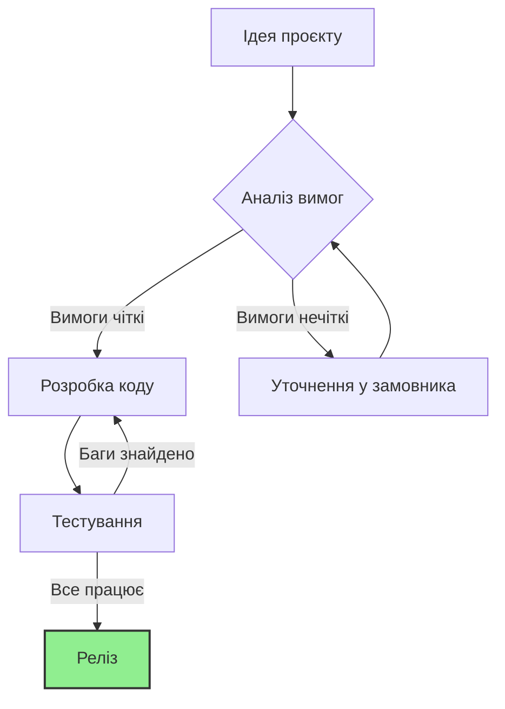

# Звіт до Лабораторної роботи №3
**Тема:** Основи Markdown
**Виконав:** Голубенко Артем, група ІКМ 223-а

Цей документ демонструє використання основних елементів Markdown.

## 1. Список улюблених книг
1.  **"Кобзар"** — Тарас Шевченко
2.  **"Дюна"** — Френк Герберт
3.  **"Відьмак"** — Анджей Сапковський
4.  **"Чистий код"** — Роберт Мартін
5.  **"Гаррі Поттер"** — Дж. К. Роулінг

## 2. Математичні формули
**Інлайн:** $E = mc^2$

**Блочні:**
$$x_{1,2} = \frac{-b \pm \sqrt{b^2 - 4ac}}{2a}$$

$$e^{i\pi} + 1 = 0$$

$$\int_{-\infty}^{\infty} e^{-x^2} \, dx = \sqrt{\pi}$$

## 3. Діаграма Mermaid
Нижче наведена діаграма процесу:

## 4. Таблиця книг
| № | Назва книги | Автор | Кількість сторінок |
| :-: | :--- | :--- | :---: |
| 1 | Кобзар | Тарас Шевченко | 720 |
| 2 | Дюна | Френк Герберт | 650 |
| 3 | Відьмак | Анджей Сапковський | 320 |
| 4 | Чистий код | Роберт Мартін | 464 |
| 5 | Гаррі Поттер | Дж. К. Роулінг | 448 |